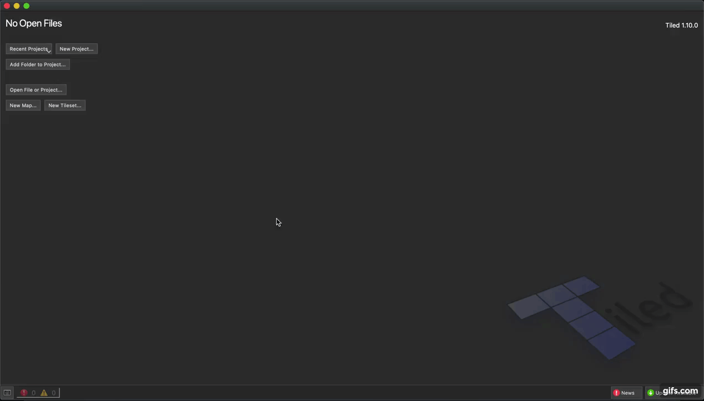
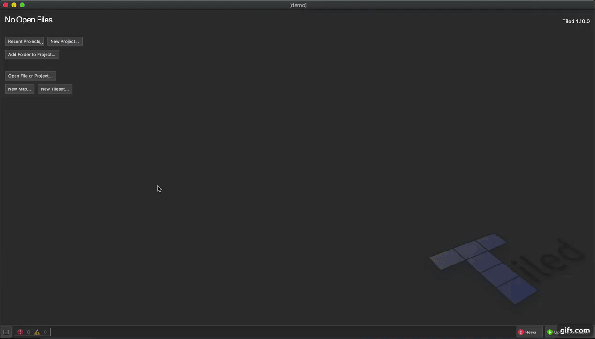
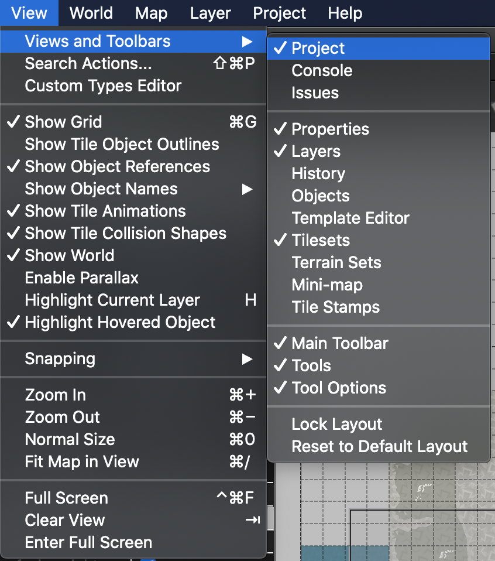
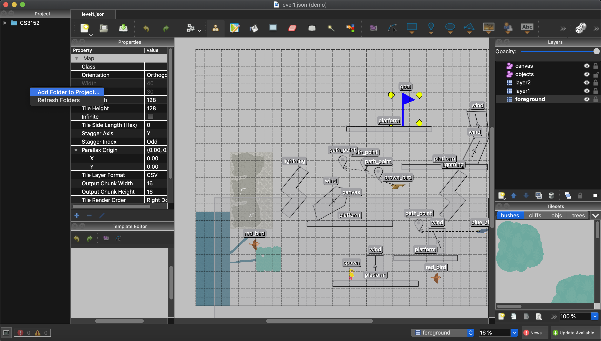
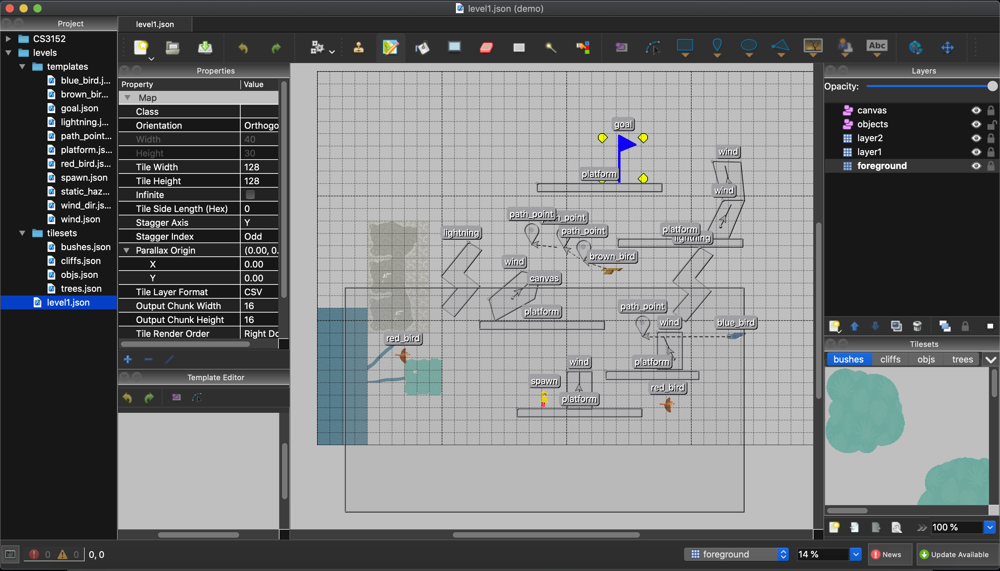
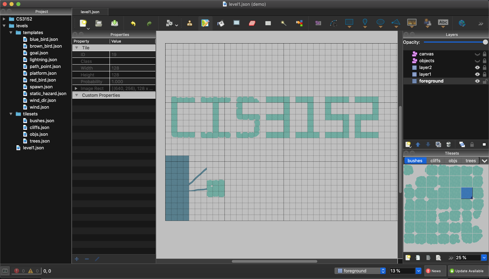

# Tiled-RRGA Usage Guide

### Author: Zhiyuan
### Supporting Team: Zhiyuan & Miguel

## Step 0: Getting Started

Visit [Tiled editor page](https://www.mapeditor.org/) if you have never done so
and download Tiled. Move on to Step 1.

## Step 1: Make a new project (or use existing one)

A _project_ is not a level map so don't skip this step just because you have a
levels/ folder!

If this is your first time using Tiled, you should make a new project. This means
that Tiled will save a project session somewhere on your pc and just pick
any local folder. Tiled session files that are generated should not be shared
with others.

If you have a project, you will see the name of the last running project on Tiled.
You may use the same one. Continue to step 2

## Step 2: Open Files

It's time to grab the folder containing the RRGA setup for levels+templates.

> **PLEASE CHECK-IN WITH US IF SOMETHING LOOKS BROKEN ON YOUR END**

------

## Step 3: Open Toolbars & Become Familiarized

1. Locate the Tiled application menu bar and select _View_ then 
_Views and Toolbars_ and enable the following

2. Add our levels folder into your Tiled running-project. Right click on 
the folder panel that you should see. The folder shown is the folder
that you have your session data stored. For mine, this happens to be
CS3152 folder.

Locate the levels/ folder and add it in.

You should feel free to expand the _template/_ folder because you will be using
it frequently.

## Step 4: Understanding Development Process

The following should generally be followed but take caution if not

- **Lock** all layers that you are not working with
- Remember to **unlock** the layer that you're editing
- Make **visible** the layer you're editing (Visibility can be turned `on/off` with 
the eye tool. If it's off, you may be blindly making edits)
- **Save** (Mac: `cmd + s`, Others: `ctrl + s`) when you have made progress that you
want to keep.
- **Undo** (Mac: `cmd + z`, Others: `ctrl + z`) if you make a mistake 
(this is better than trying to put things back).
- Make **new layer** when you want to experiment. Don't use kept layers for experiments.
Right click on layers toolbar to make new object/tile layers.
- Make **copy** of map if you want local comparison. It's just a JSON file. You can
do this by opening the levels/ folder and make a duplicate.

## Step 5: Editing Objects

### Step 5.1: Enabling Edits & Editing Properties

The following provides a quick demo to how to (in the order of)

- unlock object layer
- select object
- access and modify object properties
- move object around (translation)
- lock object layer

> DO NOT ADD EXTRA PROPERTIES WITHOUT CONSULTING WITH SUPPORTING TEAM

### Step 5.2: Rotating objects

- In general, there's no parsing support for this feature, but this is supported
for wind direction template _wind\_dir_. Simply select the object, click on it
while it is selected, and you will see an UI to rotate the object.

> TODO: **gif to be placed here**

### Step 5.3: Using Templates

Being able to use templates is important. Templates allow everyone to follow the
same conventions.

> If you think something can be made easier directly with the shape tools in
Tiled, which is foreseeable, let us know.

To use templates, we click, drag, and drop!

Terminology that may be helpful to remember

- Instance: Every time you use a template, you're creating an entity called an
instance of the template. Instances inherit all default values of a template.

- Override: Instances can have their properties changed. Properties that
require you to set a value have "unset" as default. You need to understand
each template and see which values need to be overriden and which ones
are optional to do so.

> NOTE: changes to templates does not necessarily update all instances on maps.
This is partly because objects with overriden properties are kept the way they
are. YOU SHOULD NOT BE CHANGING A TEMPLATE WITHOUT CONSULTING WITH SUPPORTING TEAM.

### Step 5.4: Being Precise & Facts

This one is difficult to achieve for most objects and polygons. If you want
coordinate-precision, you will likely have to edit positions directly rather than
dragging objects around.

Here are some things to remember, should you make such changes.

- (As of this moment) polygons do not let you directly set the position of any
given vertex. This is possible by editing the JSON file directly but you are
highly discouraged from doing so. Make a request for RRGA-TILED supporting team
to do so and try to be visually precise in Tiled for the moment.

- Box-Shape Tiled Objects (Player, Birds, _temporary_ Goal) are all defined by
the (x,y) coordinate of their **center**. You can set precise locations for these
easily (with a bit of calculations).

- For the same reason as box objects, Rectangles can have precise locations. However,
rectangles are defined by the (x,y) coordinate of their **left corner**.

- If you move your cursor around, you will see the coordinate of your cursor
in the lower left area of the Tiled application. You should be aware that
the Tiled origin (0,0) is top left corner of grid. X values increase from
left to right. Y values increase as we go down along the grid.

## Step 6: Tile Layers & Tilesets

Please access [Tiled Docs](https://doc.mapeditor.org/en/stable/manual/editing-tile-layers/)
to read more about what featurs are supported in tile layers.

### Step 6.1: Adding Tilesets

If you want to introduce a new tileset, please send such request to supporting team.
The new tileset needs to be added in code as well as tileset data to ensure
consistent level parsing.

## Step 7: Remember Some Rules

- As of this moment, any modification to instances of templates is okay: this
includes using polygon editor on an instance. Should this cause problems, we 
will have to work around this degree of freedom.

- Do not toggle features like flipping an object/tile horizontally/vertically.
This actually breaks Tiled data. Perhaps a setup issue or Tiled application bug.

- Do not modify tilesets or templates!

## Step 8: Begin!

> More details to be added based on encountered difficulties.

Perhaps useful Keys
| Key      | Description |
| ----------- | ----------- |
| H      | Highlight Current Layer|
| G | Toggle Grid|
| Tab   | See map with all toolbars hidden|
